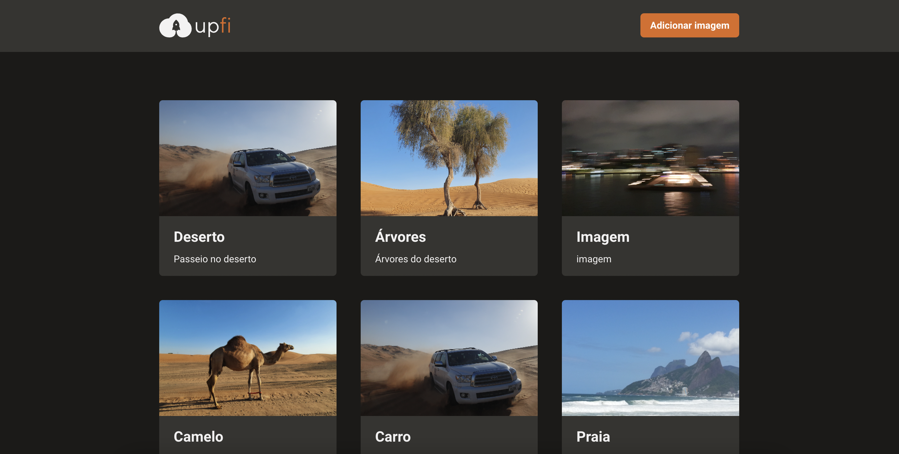

  

## Sobre o projeto

Aplicação de upload de imagens com requisições para uma API Next.js que retorna os dados do FaunaDB (banco de dados) e do ImgBB (serviço de hospedagem de imagens), utilizando:

- Infinite Queries e Mutations com React Query;
- Envio de formulário com React Hook Form;
- Exibição de Modal e Toast com Chakra UI;
- ImgBB;
- FaunaDB;
- API do Next.js;

## Principais componentes

 

### CardList

Esse arquivo é responsável pela exibição do grid de cards e o controle do Modal de exibição da imagem selecionada, utilizando o `useInfiniteQuery` [doc oficial](https://react-query.tanstack.com/guides/infinite-queries)

### AddImage

Nesse componet, tem quatro etapas principais que foi implementada:

1. As validações do formulário;
2. A `mutation` do React Query;
3. A função `onSubmit`;
4. O registro dos inputs no React Hook Form.
